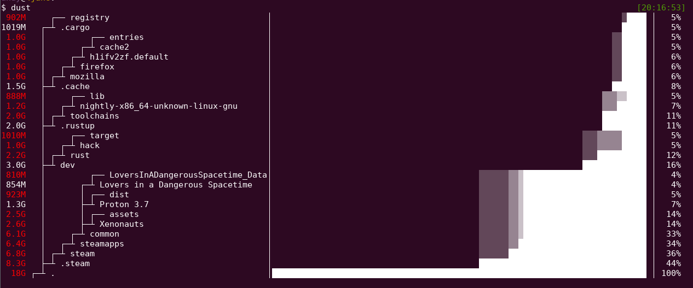

[](https://github.com/bootandy/dust/actions)


# Dust

du + rust = dust. Like du but more intuitive.

# Why

Because I want an easy way to see where my disk is being used.

# Demo



## Install

#### Cargo <a href="https://repology.org/project/du-dust/versions"></a>

- `cargo install du-dust`

#### 🍺 Homebrew (Mac OS)

- `brew install dust`

#### 🍺 Homebrew (Linux)

- `brew install dust`

#### [Snap](https://ubuntu.com/core/services/guide/snaps-intro) Ubuntu and [supported systems](https://snapcraft.io/docs/installing-snapd)

- `snap install dust`

Note: `dust` installed through `snap` can only access files stored in the `/home` directory. See daniejstriata/dust-snap#2 for more information.

#### [Pacstall](https://github.com/pacstall/pacstall) (Debian/Ubuntu)

- `pacstall -I dust-bin`

#### Anaconda (conda-forge)

- `conda install -c conda-forge dust`

#### [deb-get](https://github.com/wimpysworld/deb-get) (Debian/Ubuntu)

- `deb-get install du-dust`

#### [x-cmd](https://www.x-cmd.com/pkg/#VPContent)

- `x env use dust`

#### Windows:

- `scoop install dust`
- Windows GNU version - works
- Windows MSVC - requires: [VCRUNTIME140.dll](https://docs.microsoft.com/en-gb/cpp/windows/latest-supported-vc-redist?view=msvc-170)

#### Download

- Download Linux/Mac binary from [Releases](https://github.com/bootandy/dust/releases)
- unzip file: `tar -xvf _downloaded_file.tar.gz`
- move file to executable path: `sudo mv dust /usr/local/bin/`

## Overview

Dust is meant to give you an instant overview of which directories are using disk space without requiring sort or head. Dust will print a maximum of one 'Did not have permissions message'.

Dust will list a slightly-less-than-the-terminal-height number of the biggest subdirectories or files and will smartly recurse down the tree to find the larger ones. There is no need for a '-d' flag or a '-h' flag. The largest subdirectories will be colored.

The different colors on the bars: These represent the combined tree hierarchy & disk usage. The shades of grey are used to indicate which parent folder a subfolder belongs to. For instance, look at the above screenshot. `.steam` is a folder taking 44% of the space. From the `.steam` bar is a light grey line that goes up. All these folders are inside `.steam` so if you delete `.steam` all that stuff will be gone too.

## Usage

```
Usage: dust
Usage: dust <dir>
Usage: dust <dir>  <another_dir> <and_more>
Usage: dust -p (full-path - Show fullpath of the subdirectories)
Usage: dust -s (apparent-size - shows the length of the file as opposed to the amount of disk space it uses)
Usage: dust -n 30  (Shows 30 directories instead of the default [default is terminal height])
Usage: dust -d 3  (Shows 3 levels of subdirectories)
Usage: dust -D (Show only directories (eg dust -D))
Usage: dust -F (Show only files - finds your largest files)
Usage: dust -r (reverse order of output)
Usage: dust -o si/b/kb/kib/mb/mib/gb/gib (si - prints sizes in powers of 1000. Others print size in that format).
Usage: dust -X ignore  (ignore all files and directories with the name 'ignore')
Usage: dust -x (Only show directories on the same filesystem)
Usage: dust -b (Do not show percentages or draw ASCII bars)
Usage: dust -B (--bars-on-right - Percent bars moved to right side of screen)
Usage: dust -i (Do not show hidden files)
Usage: dust -c (No colors [monochrome])
Usage: dust -C (Force colors)
Usage: dust -f (Count files instead of diskspace [Counts by inode, to include duplicate inodes use dust -f -s])
Usage: dust -t (Group by filetype)
Usage: dust -z 10M (min-size, Only include files larger than 10M)
Usage: dust -e regex (Only include files matching this regex (eg dust -e "\.png$" would match png files))
Usage: dust -v regex (Exclude files matching this regex (eg dust -v "\.png$" would ignore png files))
Usage: dust -L (dereference-links - Treat sym links as directories and go into them)
Usage: dust -P (Disable the progress indicator)
Usage: dust -R (For screen readers. Removes bars/symbols. Adds new column: depth level. (May want to use -p for full path too))
Usage: dust -S (Custom Stack size - Use if you see: 'fatal runtime error: stack overflow' (default allocation: low memory=1048576, high memory=1073741824)"),
Usage: dust --skip-total (No total row will be displayed)
Usage: dust -z 40000/30MB/20kib (Exclude output files/directories below size 40000 bytes / 30MB / 20KiB)
Usage: dust -j (Prints JSON representation of directories, try: dust -j  | jq)
Usage: dust --files0-from=FILE (Reads null-terminated file paths from FILE); If FILE is - then read from stdin
Usage: dust --collapse=node-modules will keep the node-modules folder collapsed in display instead of recursively opening it
```

## Config file

Dust has a config file where the above options can be set.
Either: `~/.config/dust/config.toml` or `~/.dust.toml`
```
$ cat ~/.config/dust/config.toml
reverse=true
```

## Alternatives

- [NCDU](https://dev.yorhel.nl/ncdu)
- [dutree](https://github.com/nachoparker/dutree)
- [dua](https://github.com/Byron/dua-cli/)
- [pdu](https://github.com/KSXGitHub/parallel-disk-usage)
- [dirstat-rs](https://github.com/scullionw/dirstat-rs)
- du -d 1 -h | sort -h

Note: Apparent-size is calculated slightly differently in dust to gdu. In dust each hard link is counted as using file_length space. In gdu only the first entry is counted.
